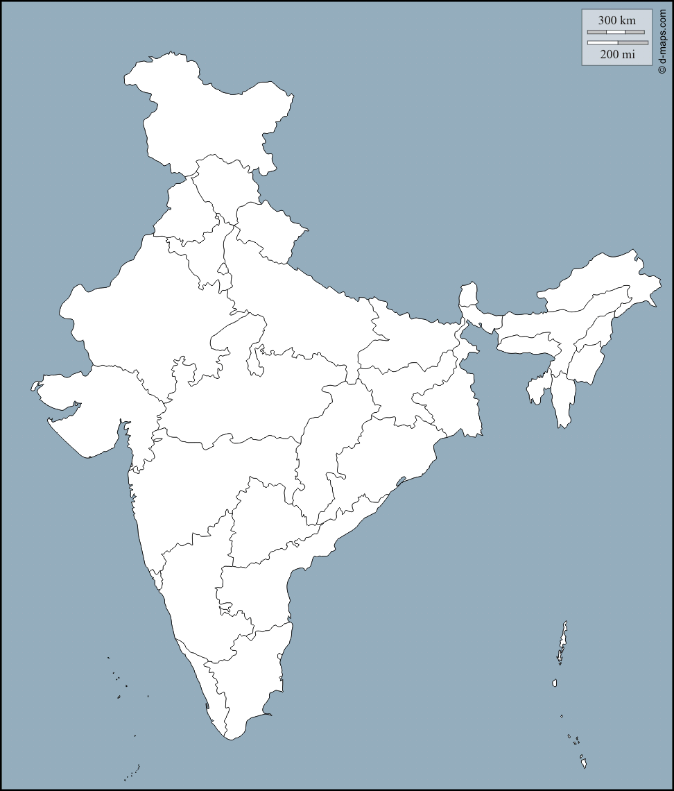

# Indian States Guessing Game

This is a simple Python guessing game that tests your knowledge of Indian states. You need to guess the names of the Indian states correctly. If you don't know a state or want to exit the game, simply type "Exit."

## How to Play

1. Run the Python script to start the game.
2. A window will pop up displaying the map of India.
3. A prompt will appear, asking you to guess the name of an Indian state.
4. Type the name of the state you think is correct and press "Enter."
5. If your guess is correct, the state's name will be displayed on the map at its location.
6. Keep guessing until you've identified all 29 Indian states.
7. If you want to exit the game at any point, type "Exit" as your answer.

## Missing States

If you couldn't guess all the Indian states and choose to exit the game, a list of the missing states will be saved in a CSV file named "states_to_be_learn.csv." You can use this list to help you learn the names of the states you missed.

## Requirements

- Python 3.x
- pandas library

## How to Run

1. Make sure you have Python installed on your computer.
2. Install the pandas library if you haven't already: `pip install pandas`
3. Run the Python script using your favorite Python interpreter.
4. Enjoy the game and have fun guessing the Indian states!

Happy playing! 🇮🇳
